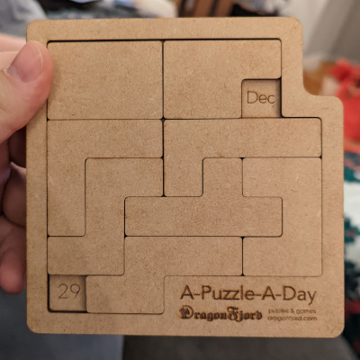
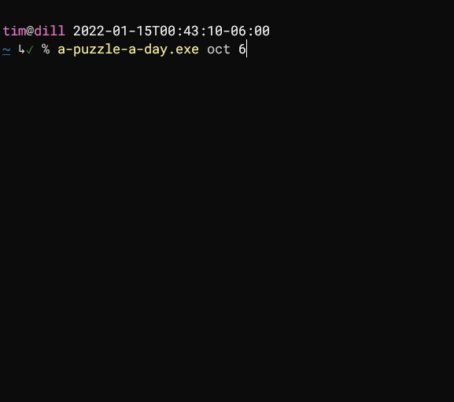

# a-puzzle-a-day

Generates solutions for [A-Puzzle-A-Day](https://www.dragonfjord.com/product/a-puzzle-a-day/), a
[combination puzzle](https://en.wikipedia.org/wiki/Combination_puzzle) with the goal of arranging 8
tiles on a board such that a particular date (2 squares) on the board is left exposed.




## Usage

Download the latest release from [release page](https://github.com/t-mart/a-puzzle-a-day/releases).

```sh
# "a-puzzle-a-day.exe --help" for help
$ a-puzzle-a-day.exe "oct" "6"
```



Make sure you have a terminal that supports truecolor (arbitrary hex triplets) and a font that can
represent the character [`█`](https://www.compart.com/en/unicode/U+2588).

## Interesting stats

- There are 59,787 *unique* solutions.

  (Here, *unique* means that the arrangement of the pieces is different from every other solution
  and we do not count solutions where a piece is rotated or flipped to produce a symmetrical
  placement.)

- Of those, 24,405 of the solutions are for *valid* dates (including Feburary 29th, the leap day).
  That represents roughly 40% of all solutions.

  (*Valid* means that the the solution leaves exposed the squares for components that could
  represent a real date. For example, "Apr" and "31" is not valid because April only has 30 days.
  Similarly, solutions with two number components or two month component are invalid because they
  are nonsensical.)

- The most solvable valid date is January 25th with 216 unique solutions. The least solvable
  valid date is October 6th with 7 unique solutions.
